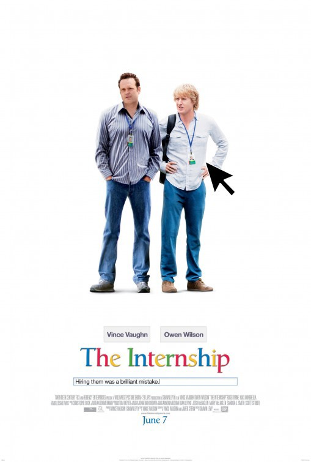

日記を書いて2000日になりました。1000日目を達成したときを思い出します。アメリカで生活をする上で達成したかった目標は達成できていたけど、日記を書き始めたときにこうなりたいと思っていたものはまだ実現しておらず、実現させる方法も検討がつかなかった時期でした。

そこから1000日が経ちました。この1000日は一番最初に思い描いていたことが実現した時期、憧れが現実になった時期でした。日記を書き始めて39日目の2013/12/27、この日は僕がアメリカにまた戻ってきた日です。こんなことが書いてあります。

> アメリカについた。日本に着いた時のようなついたーて安心する感じはない。
> 
> だけど、この3年で必ずアメリカを俺のホームにしてやる

そして、このアメリカに戻る飛行機で[The Internship](https://www.imdb.com/title/tt2234155/)という映画を見たのです。

この映画は中年二人がGoogleのインターンシップに参加する、コメディ映画です。笑える映画でありながら、Googleという会社の雰囲気を知りました。そして、Googleでインターンシップをすることが大学卒業までの目標になったのです。

残念ながら、大学在学中にGoogleでインターンシップをすることは達成できませんでした。電話面接があったのですが、準備が全く出来てなかったので、惨敗でした。

Googleを目指し始めた日から時が経ち、幸運にもGoogleからオファーをもらいました。そして、2019/05/13に働き始めます。

自分の憧れを達成するのに1961日もの時間が経ってしまいました。

これを長いと見るか、短いと見るか人それぞれです。例えば、プロ野球選手を目指す少年少女たちが実際に夢を叶えるのに10年以上はかかるでしょう。僕は長いとも短いとも感じていません。目標を達成するために、ただそれだけの時間が必要だっただけです。(もちろん、環境・家族の影響あってこそです)

 

でも、まだまだです。全然足りません。もっといいエンジニアになりたいし、できるようになりたいこともたくさんあります。なので、次の1000日も走り続けます。1000日後が楽しみです。

2019.05.10 Kohei Arai

* [日記を1000日書いてわかったこと](/1000-diary)
* [Googleからオファーをもらうまで](/google)
* [シリコンバレーで仕事を得るまでの経緯](/silicon-valley)