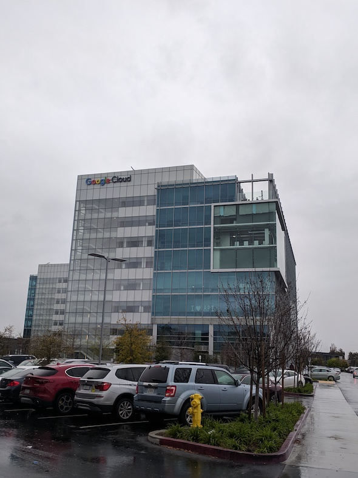
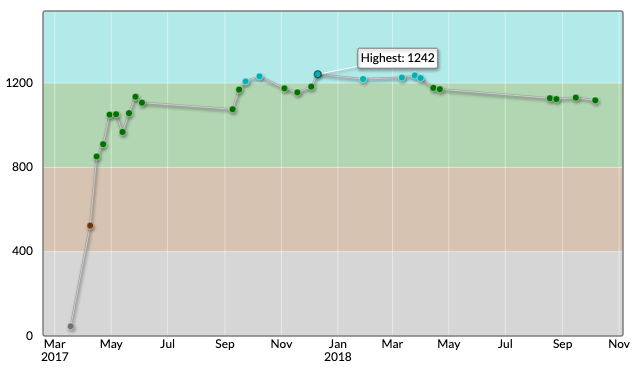

念願だったGoogleからオファーが届き、働けることになりそうです。この記事ではオファーをもらうにいたるまでの経緯と自分のした準備をまとめます。

<blockquote class="twitter-tweet" data-lang="en">
GoogleからのオファーをacceptしたのでGoogleに転職します！ ずっと憧れだったので嬉しい:)  とにかくいいコードをたくさん読んで、いいコードをかけるようになります！
&mdash; Kohei@シリコンバレー (@koheiarai94) <a href="https://twitter.com/koheiarai94/status/1115717398508654592?ref_src=twsrc%5Etfw">April 9, 2019</a></blockquote>

なお、僕の場合はアメリカ生活が長いので英語は問題になりませんでした。

## リクルータから連絡がくる (2018.11)

Hello again from Google！こんなタイトルのメールが2018年の11月に届きます。内容は近況を知りたいとのことでした。一年ほど前にGoogle Foobar Challengeに取り組んでおり、連絡先を渡していました。Foobar Challengeとは、Googleからランダムに招待されるプログラミングチャレンジです。このチャンレンジを解きすすめると連絡先が聞かれ、リクルーティングが始まります。

解いた当時はすでに内定が決まっていたため、採用プロセスには進みませんでした。しかし、働き始めると経済的にもチーム的にもフィットしなく、転職を考え始めます。そんな折のメールは渡りに船でした。年末は忙しくなりそうだったので、年が明けてから連絡すると返信します。

転職すると決めていたので年末やクリスマスは勉強に費やしました。Frontend engineerとして転職することを考えていたため、有名な[You Don't Know JS](https://github.com/getify/You-Dont-Know-JS)でJSについての理解を深めていきました。

## リクルータと話す (2019.02)

JSについての勉強が意外と長引いてしまったため、折り返したのは1月の終わりになってしまいました。2月の中旬にリクルータと話すアポをいれます。彼とは

* 今どんなことをしているのか
* どんなタイムスケジュールで転職を考えているのか
* 次に転職するにはどんな仕事がしたいか
* どんな会社で働きたいか
* Phone interviewではどんなことが聞かれるのか (Phone Interviewとは電話で行われる一次面接です)

などを話しました。電話のあとには、Phone interviewに準備するためのビデオが送られてきました。問題に対してどのようなアプローチを求めているのかがわかります。

<iframe width="560" height="315" data-src="https://www.youtube.com/embed/XKu_SEDAykw" frameborder="0" allow="accelerometer; autoplay; encrypted-media; gyroscope; picture-in-picture" allowfullscreen class="lazyload"></iframe>

## Phone Interview (2019.03.07)

LeetCodeで対策し、充分に準備できたと思ったのでPhone Interviewに臨みます。11時に設定しその日は会社を午前中休みました。1時間だと思い解いていたら、実は45分でコードを完成させられませんでしたが、完成できなかった部分は口頭で伝えてカバーしました。

翌日、リクルータからちょっと話せるかと連絡が来ます。Phone Interviewをパスしたと伝えられました！

別のリクルータが担当になり、オンサイトのインタビュー形式について説明を受けます。オンサイトインタビューとは会社に出向いて行うインタビューです。これでオファーが出るかどうかが決まります。まとめると

* 4回から5回行われる
* 1回45分
* ラップトップは支給されずホワイトボードにコードを書く
* 聞かれる内容は電話面接のときと変わらずアルゴリズムについて
* 途中でお昼休憩が入る
* 服装はビジネスカジュアル

でした。後日、希望する日時を提出し、オンサイトインタビューが決まりました！

## Onsite Interview (2019.03.22)

9:45から面接です。Googleに入るときは、まさか自分がGoogleのインタビューに来れるとは思っておらず感激しました。記念に撮った写真です。空模様はよくなく小雨でした。

守秘義務があるため問題は公表できませんが、

* 一問目はまぁまぁの出来栄え (3/5)
* 二問目はヒントを与えられながらなんとか解法を書き上げる (3/5)
* 三問目もおそらく及第点 (3/5)
* 四問目は今までうまく書けたため油断し大失敗、明らかに失敗とわかるパフォーマンス (1/5)
* 五問目は逆にパーフェクト、相手が用意していたすべての問題を解き時間が余る (5/5)

でした。()内の数字は自己評価です。どの面接もみっちり45分問題を解き、終わったら次の面接官が入ってきて間髪いれず次の面接が始まりました。どうだろうと思いながら、帰路につきます。通ってもおかしくない手応えでした。

ここから待つ時間が始まります。そして、遂に4/3にリクルータからオファーがでるとの報告が来ました！

## 給与交渉 (2019.04)

ここからは給与交渉です。現職からGoogleへ移った友達がいたので彼女に相談します。すると、こちらのリンクをシェアしてくれました。[Salary Sharing thread for NEW GRADS :: December, 2018](https://www.reddit.com/r/cscareerquestions/comments/a39y3m/official_salary_sharing_thread_for_new_grads/)このリンクをみながら、どんな学位の人がどの会社でどれくらいの給料をもらったかを確認していきます。下は約1300万から2600万くらいまでいました($1=100円で計算しています)。給与交渉の大切さが身にしみます。

最初多めにふっかけ、相手が考える適正価格を把握しながら最終的に希望を出します。

後日リクルータが決まった金額を持ってきました。異論なかったので、その条件で話が進みます。働き始める日を決めれば正式なオファーが届きます。それにサインをすれば一段落です。

犯罪歴がないかのチェックや、現職の同僚・前職のボスからの勤務態度などの裏付けが残っていますが、それらはよっぽど黒いことがないとオファーは覆られないはずです。

## インタビューの準備に何をしたか

インタビューの準備は2つにわけられます。

1. 問題を解く力を養うための訓練
2. 面接で自分の考えを説明する訓練

1に関してはLeetCodeをたくさん解きました。合計で200問ほど解き、復習が必要な問題はスプレッドシートにまとめ複数回ときました。解法が理解できなかった質問も加え、時間をおいて再度訪れるようにしました。友達が[コーディング面接対策の本](https://github.com/liyin2015/Algorithms-and-Coding-Interviews/blob/master/Preparing_for_the_real-world_software_engineering.pdf)を書いていたため、実験台となりコンセプトごとにたくさん問題を解きました。この経験から解いてよかったと思う60問をピックしました。よろしければ使ってください。

* [コーディング面接対策のために解きたいLeetCode 60問](/leetcode)

2に関しては実際に人の手を借りる対策とオンラインを使った対策の2つを行いました。Googleに転職した友達や知り合いのGooglerの方に頼んで模擬面接を行ってもらいました。オンラインでは有料で模擬面接を行ってくれる[Technical Mock Interview](https://www.techmockinterview.com)を使用しどんなことが聞かれるかを把握しました。

このサービスはGoogle, Facebook, Amazonで最低2年以上働き、なおかつ実際に50回以上インタビューを行っている方たちが、模擬面接を行いフィードバックをくれます。1時間のセッションで$109です。高いですが、実際に働いてる人たちのフィードバックがもらえて、Strong hireやInclined to hireの評価がつくのは自信になりました。

## 競プロは役に立つのか

間違いなくGoogleなどのコーディング面接に有効だと断言します。ただし、このようにコードを書かせる面接を行う会社は多くないと感じているのでご自身が入りたい会社にあわせた対策をしてください。僕のatcoderレーティング最高値は1242で[水色コーダー](https://atcoder.jp/users/kohei94)です。

「水色以上の方はGoogleに入れる可能性が充分にある」が僕の考えです。

以上になります！質問や相談等は僕の[Twitterアカウント](https://twitter.com/koheiarai94)までおねがいします:) 参考までに僕の履歴書や就活記事を置いときます。履歴書は[zety](https://zety.com/)を使いました。

* [履歴書](https://drive.google.com/file/d/1JvSQem8KZfPqcop3Etewuezb1c6tHad7/view?usp=sharing)
* [シリコンバレーで仕事を得るまでの経緯](/silicon-valley)
