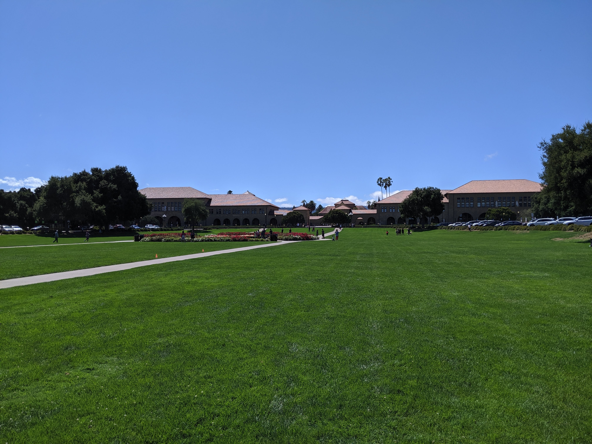

この記事は[社会人学生 Advent Calendar 2019](https://adventar.org/calendars/4496)の14日目の記事です。

Rui Ueyamaさんの[スタンフォードの単位は通わなくてもリモートで取れるよ、テストとかの難易度は同じで](https://note.com/ruiu/n/n7e1a79f5e9e4)という記事を読んでから、いつかは自分もと思っていたのでクラスをとることにしました。

スタンフォードでは、SCPD(Stanford Center For Professional Development)という社会人を対象にしたプログラムが提供されており、働きながら授業をとることが可能です。授業はキャンパスで行われたものが録画され、オンラインで共有されます。宿題やテストもリモートで完結するので、カリフォルニアにいなくてもクラスがとれます。

SCPDでは修士号を目的にするコースと、それ以外にわかれており、僕はそれ以外のコースで授業を受けました。それ以外では単位はとれますが、学位にはつながりません。後にスタンフォード大学院への入学が認められれば、18単位まで移行できます。ゆくゆくはパートタイムで修士をとろうと考えているのでお試しのつもりでうけました。

とったクラスは「CS107 コンピュータの構成とシステム」です。2進数から始めてスタックやメモリがどう使われているかを学び、x86の命令セットやmallocまで広げていきます。最後の宿題はmallocを実装するもので、非常にやりがいがありました。

このクラスは学部生がとるコンピュータサイエンスへの導入で、ラボが用意されています。二人一組のペアになりパソコンを共有しながら、課題に取り組みます。SCPD生はリモートでするオプションがあるのですが、せっかくなので友だちになったSCPDの方と一緒に参加してました。学部生に混じり、院生の指導の元わからないことを聞いたりするのはとても楽しかったです。

クラスをとったきっかけにトップ大学で行われているコンピュータサイエンスの教育を知りたいといったモチベーションがあります。僕はアメリカの大学でコンピュータサイエンスを学びましたが、知識不足を感じるからです。トップの大学ではどのような授業が行われるのだろう、自分が受けた教育とどのように違うのだろうとずっと疑問でした。

その疑問に答える経験を今回できました。まず、宿題は大学内にあるUbuntuにsshして行います。Emacsでファイルを編集することが推奨され、Makefileと基本的なテストケースが提供されます。さらに自分でテストケースを用意するファイルが必ず入っており、それも採点されます。自分のプログラムの正当性を自動で確認できるツールが揃っています。

僕の大学ではそのような仕組みはほとんどなく、大学が使っているウェブアプリに宿題をアップロードするスタイルでした。いくつかのクラスではGitを用いて提出したと思いますが、提出するプログラムが正しいかは手動でチェックしていました。

採点の方法も違いました。自動ツールでチェックされます。各宿題ごとにさまざまなテストケースが用意されており、特定のテストケースをパスするごとに加点されます。加えて、TAからのコードレビューも成績に含まれます。自分の大学では採点があまりオープンではなかったので感心しました。

テストを用意したり、Linuxコマンドラインに慣れたり、sshしてファイルをターミナル上で編集したり、きれいなコードを意識するなど。ソフトウェアエンジニアとして働く上で基礎的なことだけど、大学ではあまり教えてくれないことが宿題を通して自然と体得できる設計になっていました。

講師の方も非常にレベルが高かったです。彼はまだ20代で2018年にStanfordでコンピュータサイエンスの修士を修了後、講師として働き始めました。GoogleとAppleでのインターンも経験しています。いい講師の条件の一つとして、生徒の質問に素早く正確に答えられること、と僕は考えているのですが、彼の答えはどれも正確でどんな質問を投げても大丈夫と安心できるものでした。

僕が学士でコンピュータサイエンスを学んだときは、学んだことがどのように実生活で使われているかがわからず不満でした。このクラスでは実生活での事例の紹介もたくさんありました。

整数オーバーフローのときは2012年にヒットしたカンナムスタイルの再生回数が32ビット整数の上限を超え[カンストした](https://news.yahoo.co.jp/byline/taromatsumura/20141204-00041207/)事例や、初代Civilizationで平和の象徴のガンジーが[核攻撃してくるバグ](https://note.com/ruiu/n/n89d18450b1bb)など。アセンブリを学んだときは2017年にAppleのHigh Sierraで起きたルートアクセスのバグについての[詳細な解説記事](https://objective-see.com/blog/blog_0x24.html)だったり。理解できなかったものもありましたが、学びと実生活のリンクを知れるのはよかったです。

以上、今回とったCS107について絶賛してきました。一つだけのクラスですが、「なるほど、これがトップの大学で行われている教育か」と非常に勉強になりました。たまたまこのクラスだけよかったのかもしれません。インストラクターのおかげかもしれません。これから先、自分の意見がどう変わるかが楽しみです。次は「CS110 コンピュータシステムの基礎」をとります。
