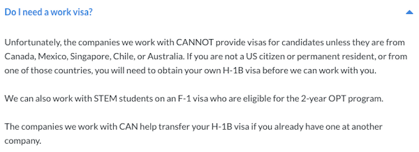
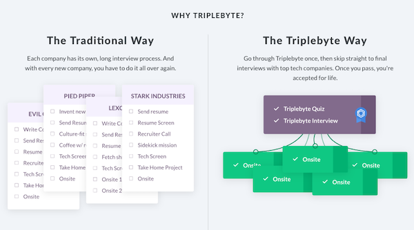
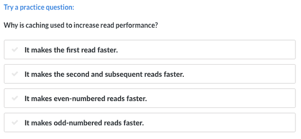
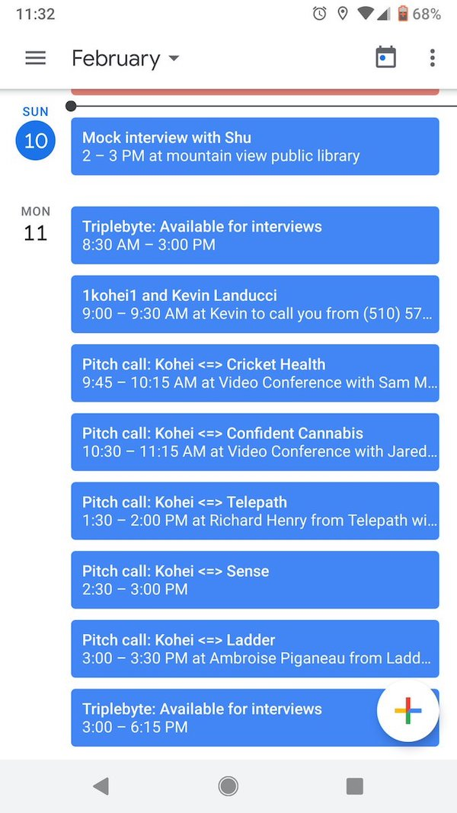
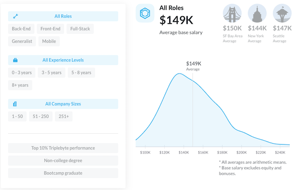
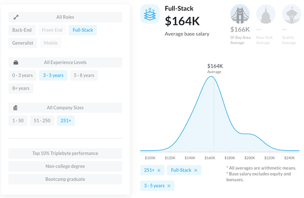

この記事では、僕が転職するさいに使用した就職サービスの[TripleByte](https://triplebyte.com)を紹介します。TripleByteの良い点は以下のとおりです:

* レジュメをアップロードする必要がない
* スクリーニングにパスすれば、複数の会社から面接の招待が来る

シリコンバレー、ニューヨーク、シアトル、ロスアンゼルスで展開しています。田舎の大学でこういった大都市の会社にアプローチしづらい、職歴がなくレジュメを提出しても面接にたどりつけないという方におすすめです。また、本命の面接の前に練習したいといったケースでも使えます。

Uber, Apple, Robinhood, Box, Twitch, Evernoteなども使用しておりこれらの会社にレジュメスクリーニングなしで、挑戦できる可能性がもらえる非常に優れたサービスです。

## Disclaimer

日本人が海外で働く際にはビザが必要になります。TripleByteは次の条件のうち一つを満たしていないと使うことができません。ご了承ください。

* カナダ/メキシコ/シンガポール/チリ/オーストラリア出身の方
* H-1Bビザをすでに持っている方
* STEMメジャーをF1ビザで専攻し、OPT extensionが適用される方
* アメリカ市民、もしくはグリーンカード持ち

[Do I need a work visa?](https://triplebyte.com/candidate_faq#question-9)というFAQも用意されています。

## 既存のリクルーティングプロセスの問題

既存のプロセスでは会社の求人サイトで応募しなくてはいけません。応募する会社ごとに、履歴書をアップロードし、実績を入力したりということを繰り返します。会社側は応募に来た候補者を**すべて**ふるいにかけなくてはいけません。計算量でいうとO(N)です。

TripleByteはこの最初のプロセスを肩代わりします。候補者のスキルを測るスクリーニングを行い、それをパスしたものだけが就職活動を行えます。こうすることで

* **候補者**はTripleByteを通して、複数の会社の面接に行けるようになります。
* **会社**は実力が測られた候補者を、従来の労力を使わずに面接することができます。

というWin-Winの状況を作ることができます。就職が決まるとオファーを出した会社はTripleByteに給与のX%を払います。これにより、候補者は無料で利用することができます。

2015年にスタートし、2019年4月には3500万ドルの資金調達を[行いました](https://triplebyte.com/blog/announcing-our-35-million-series-b)。

## スクリーニング

スクリーニングは2つにわけられます。

1. テクニカルクイズ
2. 2時間の電話面接

テクニカルクイズは30分ほどで終わる4択問題です。基本的なプログラミング、ウェブ開発、基本的なアルゴリズム、システムデザインなどのトピックから出題されます。例えばこんな問題。

これは練習問題です。これを解くとEメールアドレスが求められ実際のクイズが始まります。ウェブフロントエンジニア、モバイルエンジニア、一般的なエンジニアの3つのキャリアが用意されており、選んだキャリアでクイズの内容も変わります。興味がある方は[こちら](https://triplebyte.com/users/start)から始められます。

テクニカルクイズをパスしたあとは2時間の電話面接です。準備するためのリンクなどをシェアしてくれ、準備が出来た段階で候補者がスケジュールします。僕はフロントエンドエンジニアを選択していたので、以下の構成でした。

1. ミニプロジェクト (60分)
2. 一問一答 (30分)
3. システムデザイン (30分)

ミニプロジェクトはモニターを共有して、コードを書きながら行うプロジェクトです。まっさらな状態から始めて相手が求めるシングルページアプリケーションを作成していきます。5つタスクがあり、それらを自分の考えを説明しながら実装していきます。

一問一答ではウェブ開発に関するあらゆることが聞かれます。これは事前にシェアされる教材リンクを読み込んでおけば大体答えることが出来ます。

システムデザインは大規模なシステムを作る際に、どういう構成にするかをディスカッションする問題です。あまり経験がなくうまく答えられませんでした。

## スクリーンをパスすると

これらのスクリーニングをパスすると、職歴やどこで働きたいかの希望を提出します。TripleByteからお祝いの品も届きます。

<blockquote class="twitter-tweet" data-lang="en">
TripleByteからのSwag(お祝い品？)みたいなものが届いた！ポータブルチャージャーは持ってないから嬉しい(使うデバイスないけど <a href="https://t.co/JsZ11ZHQ6a">pic.twitter.com/JsZ11ZHQ6a</a>
&mdash; Kohei@シリコンバレー (@koheiarai94) <a href="https://twitter.com/koheiarai94/status/1097695498213838848?ref_src=twsrc%5Etfw">February 19, 2019</a></blockquote>

## ピッチコール

スクリーニングをパスしたあとはピッチコールという段階に入ります。これは僕のプロフィールやスクリーニングの結果を見て興味をもった会社と30分話すための時間です。

この30分で相手の事業内容やエンジニアリングカルチャー、求めてるポジションなどを話し、オンサイト面接に進むかを判断します。自分から会社へファボして気になってることを伝えることも出来ます。Striple, Asana, Instacart, Boxなどをファボしましたが、連絡が来ることはありませんでした。

約15件ほどの会社と話し、3社オンサイト面接へ進みました。その中には日本でよく使われている[Mercari](https://www.mercari.com/)もありました。

## 給与交渉

オンサイト面接を経てオファーがもらえると給与交渉です。TripleByteはすべての候補者に対して会社が提供した年収のデータをもっています。それらを用いてどんな経歴の候補者が、どれくらいもらってるかを知れるツールを[公開しています](https://triplebyte.com/software-engineer-salary)。

ツールによるとTripleByteを通して出るオファーの平均年収は$149Kで、中央値は$146Kです。このツールはストックオプションやボーナスを除いた年収でデータを取っています。

例えばFull-Stackエンジニアで、経験年数が3-5年で、転職した会社のサイズが251人以上の場合、平均値は$164K/中央値は$162Kになります。

これらのデータを使って給与交渉に臨むといいでしょう。また、スクリーニングをパスするとキャリアの相談に乗ってくれるアドバイザーがつくので、彼/彼女らに給与交渉の方法などを相談するのをおすすめします。

## リファーリンク

TripleByteが気になった方は以下のリンクからサインアップして、ぜひTryしてみてください。[TripleByte referral link](https://triplebyte.com/iv/QrWLRzG/cp)

[Twitter](https://twitter.com/koheiarai94)で相談を受け付けています。TripleByteのことでわからないことがあったらDMでご連絡ください。参考までに転職中に使っていた僕の履歴書と、就活体験記を置いときます。履歴書は[zety](https://zety.com/)で作りました。

* [履歴書](https://drive.google.com/file/d/1JvSQem8KZfPqcop3Etewuezb1c6tHad7/view?usp=sharing)
* [シリコンバレーで仕事を得るまでの経緯](/silicon-valley)
* [Googleからオファーをもらうまで](/google)